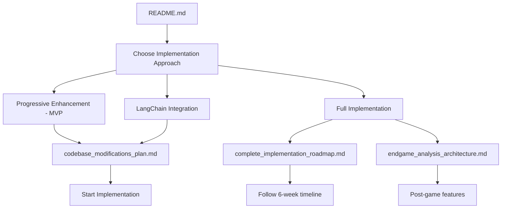

# AI Coach Project - Document Index

## 📋 Planning Documents

### 1. **Master Implementation Plan**
- **File**: `planning/llm_coaching_implementation_plan.md`
- **Purpose**: Comprehensive overview of LLM coaching system
- **Contains**: 
  - Training data generation pipeline
  - Model architecture specifications
  - Knowledge distillation process
  - Integration with existing game metrics

### 2. **Complete Implementation Roadmap**
- **File**: `planning/complete_implementation_roadmap.md`
- **Purpose**: Detailed 6-week implementation timeline
- **Contains**:
  - Day-by-day implementation schedule
  - Success metrics and KPIs
  - Risk management strategies
  - Quality assurance plan

## 🔧 Technical Specifications

### 3. **Codebase Modifications Plan**
- **File**: `technical_specs/codebase_modifications_plan.md`
- **Purpose**: Detailed code changes required
- **Contains**:
  - File-by-file modification specifications
  - Code examples for all changes
  - Integration dependencies
  - Risk assessment for each change

### 4. **Endgame Analysis Architecture**
- **File**: `technical_specs/endgame_analysis_architecture.md`
- **Purpose**: Post-game comprehensive analysis system
- **Contains**:
  - Behavioral pattern analysis engine
  - Educational recommendation system
  - Frontend modal and visualization
  - Performance optimization strategies

## 🚀 Implementation Strategies

### 5. **LangChain Integration Plan**
- **File**: `implementation/langchain_integration_plan.md`
- **Purpose**: Simplified implementation using LangChain
- **Contains**:
  - LangChain/LangGraph integration
  - Reduced dependency approach
  - oLLM integration strategy
  - Minimal viable implementation

### 6. **Progressive Enhancement Strategy** ⭐ **RECOMMENDED**
- **File**: `implementation/progressive_enhancement_strategy.md`
- **Purpose**: Minimal-risk MVP approach
- **Contains**:
  - Single file addition strategy
  - Zero breaking changes approach
  - Gradual feature rollout plan
  - Risk mitigation with fallbacks

## 🎯 How to Use These Documents

### **For Quick Start (MVP)**:
1. Read: `README.md` (this file)
2. Follow: `implementation/progressive_enhancement_strategy.md`
3. Result: Working AI coaching in 1 week with minimal risk

### **For LangChain Approach**:
1. Read: `README.md` 
2. Review: `implementation/langchain_integration_plan.md`
3. Follow: Simplified integration steps
4. Result: Enhanced capabilities with reduced complexity

### **For Full Implementation**:
1. Read: `README.md`
2. Review: `planning/llm_coaching_implementation_plan.md`
3. Follow: `planning/complete_implementation_roadmap.md`
4. Reference: All technical specs as needed
5. Result: Complete AI coaching system in 6 weeks

### **For Code Changes**:
- **What to modify**: `technical_specs/codebase_modifications_plan.md`
- **How to modify**: Specific code examples included
- **Risk assessment**: Each change evaluated for impact

### **For Post-game Analysis**:
- **Architecture**: `technical_specs/endgame_analysis_architecture.md`
- **Implementation**: Complete frontend/backend specifications
- **Features**: Behavioral insights, educational recommendations

## 🔄 Document Relationships

## 📅 Implementation Timeline Options

| Approach | Timeline | Complexity | Features | Risk |
|----------|----------|------------|----------|------|
| Progressive Enhancement | 1 week | Low | Basic AI coaching | Very Low |
| LangChain Integration | 2-3 weeks | Medium | Enhanced capabilities | Low |
| Full Implementation | 6 weeks | High | Complete system | Medium |

## 🛠️ Technical Requirements

### **All Approaches**:
- Python 3.9+
- Existing RPS game codebase
- 4GB+ RAM for inference

### **Progressive Enhancement**:
- +1 new file (`enhanced_coach.py`)
- +20 lines in existing files
- Optional: Pre-trained model

### **LangChain Approach**:
- LangChain dependencies
- Local oLLM model (Llama-3.1-7B or similar)
- ~500MB disk space

### **Full Implementation**:
- Training environment (16GB+ RAM)
- Teacher models for knowledge distillation
- Production deployment setup

---

*All documents are self-contained and include complete implementation details*